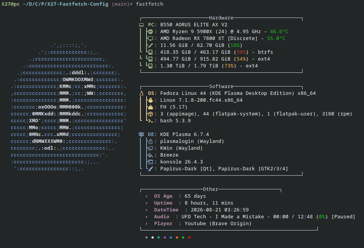

# X27-Fastfetch-Config


## What's in it

- Distro logo recolored to a Nord frost blue / snow white two-tone
- **Hardware**: PC, CPU + GPU (with live temperature), memory, disks
- **Software**: OS, kernel, bios, packages, shell
- **DE**: desktop/login/window manager, WM theme, terminal, icon theme
- **Audio**: currently playing media + player, highlighted in red
- **Uptime / Age / DT**: install age, uptime, current date/time
- Terminal color palette strip at the bottom

## Requirements

- [fastfetch](https://github.com/fastfetch-cli/fastfetch) **2.42.0+** (hex logo colors aren't supported before that — distro repo packages, especially Debian's, can lag well behind this;
  grab a current build from the [releases page](https://github.com/fastfetch-cli/fastfetch/releases) if `fastfetch --version` is older)
- A [Nerd Font](https://www.nerdfonts.com/) in your terminal, or the icons will render as blank boxes.
  Don't want to switch your whole terminal font? Install the
  [Symbols Nerd Font Mono](https://github.com/ryanoasis/nerd-fonts/releases/latest/download/NerdFontsSymbolsOnly.tar.xz)
  (the icons-only "Symbols Only" package) and set it as a fallback font instead. That's what was used to render
  the preview above.

## Usage

```sh
cp fastfetch/config.jsonc ~/.config/fastfetch/config.jsonc
fastfetch
```
